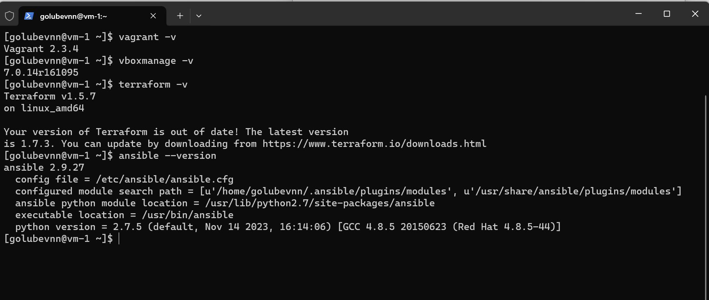
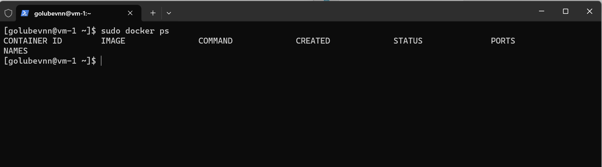

## Задача 1

- Опишите основные преимущества применения на практике IaaC-паттернов.

По моему мнению основным преимуществом IaaC является увеличение степени автоматизации развёртывания инфраструктуры, а соответственно увеличение скорости выполнения этой операции и снижение трудозатрат на её выполнение. Из данного преимущества проистекают и все остальные положительные аспекты IaaC такие, как: масштабируемость, стабильность, обеспечение версионности и облегчение документирования (по сути сам конфигурационный файл является документом описывающим инфраструктуру), увеличение безопасности за счёт снижения количества мануальных операций и т.д. 

- Какой из принципов IaaC является основополагающим?

Идемпотетность. То есть мы получаем одинаковый результат при повторных выполнениях операций.

## Задача 2

- Чем Ansible выгодно отличается от других систем управление конфигурациями?

Использование существующей инфраструктуры SSH. Нет необходимости установки дополнительных агентов. Легкость описывания конфигурации. Для описывания конфигурации используется YAML, который удобно читать и его легче освоить


- Какой, на ваш взгляд, метод работы систем конфигурации более надёжный — push или pull

Push. При этом методе есть централизованная точка распространения, из который можно следить за ходом выполнения доставки. Нет необходимости мониторить состояние агентов на удаленных серверах.

## Задача 3

Установите на личный linux-компьютер(или учебную ВМ с linux):

- VirtualBox
- Vagrant
- Terraform
- Ansible


## Ответ:

[golubevnn@vm-1 ~]$ vboxmanage -v
7.0.14r161095

[golubevnn@vm-1 ~]$ vagrant -v
Vagrant 2.3.4

[golubevnn@vm-1 ~]$ terraform -v
Terraform v1.5.7
on linux_amd64

[golubevnn@vm-1 ~]$ ansible --version
ansible 2.9.27
  config file = /etc/ansible/ansible.cfg
  configured module search path = [u'/home/golubevnn/.ansible/plugins/modules', u'/usr/share/ansible/plugins/modules']
  ansible python module location = /usr/lib/python2.7/site-packages/ansible
  executable location = /usr/bin/ansible
  python version = 2.7.5 (default, Nov 14 2023, 16:14:06) [GCC 4.8.5 20150623 (Red Hat 4.8.5-44)]




## Задача 4 

Воспроизведите практическую часть лекции самостоятельно.

- Создайте виртуальную машину.
- Зайдите внутрь ВМ, убедитесь, что Docker установлен с помощью команды

```
docker ps,
```

## Ответ:

[golubevnn@vm-1 ~]$ sudo docker ps
CONTAINER ID        IMAGE               COMMAND             CREATED             STATUS              PORTS               NAMES

